I recently built the `for-science` keyboard and I followed this guide: https://github.com/peej/for-science-keyboard

## Bill of Material
1. [kit](https://stackskb.com/store/for-science-split-keyboard-diy-kit/): 1800 INR
2. [arudio pro micro compatible X2](https://robocraze.com/products/pro-micro-5v-mini-leonardo-compatible-with-arduino): 908 INR
3. [Soldering Station](https://robocraze.com/products/soldron-variable-wattage-micro-soldering-station): 1305 INR
4. Soldering wire from Robocraze: 21 INR
5. Digital Multimeter from Robocraze: 199 INR
6. Key Switches from stackskb - Gateron G Pro 2.0 Brown KS-9 Tactile Switch - 50 pieces: 1000 INR
7. Key Caps from stackskb - Cherry Profile Pudding Keycaps - 130 caps: 1000 INR
8. TRRS cable from a local shop in Hyderabad: 200 INR
9. Desoldering Flux from a local shop in Hyderabad: 350 INR
10. Desoldering Wick from a local shop in Hyderabad: 300 INR

## Journey

While building the keyboard, I started with following the guide mentioned above, but It was not descriptive enough so I supplemented it with other guide for [Lily58](https://github.com/kata0510/Lily58/blob/master/Pro/Doc/buildguide_en.md).

While following the guide whenever I had doubts, I referred to the [gerber](https://github.com/peej/for-science-keyboard/tree/master/gerber) file [here](https://www.gerblook.org/). It helped me to find which side was up by linking the TRRS jack and the pro micro's `D0` pin as mentioned [here](https://golem.hu/article/pro-micro-pinout/).

### Mistakes I made:
1. Bad Soldering; Advice that I will give if you are new to soldering is to practie and make sure you can solder as mentioned on this [blog](https://learn.adafruit.com/adafruit-guide-excellent-soldering/common-problems).
2. I soldered the `Pro Micro` chip, before soldering the switches. Which caused lots of issues as I tried to fix the mistake using desoldering pumps, desoldering wicks and flux. But in the end it didn't help and only damaged swithes and pro micro chip. Luckily I had spares swithes and few wires, so I sorted to them to make it work somehow. Lesson is to double/triple check components you are soldering, as desoldering is very painful and can damage components.
2. The TRRS cable that I had was faulty or I spoiled it, so had to get a new TRRS cable. Lesson would be to keep cheking connectivity of your ciruit with the gerber files using the `continuity mode` of Multimeter.

### Issues that I still have with my keyboard:
1. Right side doesn't work individually, i.e. if I connect the keyboard to the left split it works, but If I conncet using the right split, It doesn't. I tried this [blog](https://docs.splitkb.com/hc/en-us/articles/360010588860-Only-one-half-of-my-keyboard-works-at-a-time-but-not-when-they-are-both-connected), but It didn't help.
2. Sometime the whole keyboard hangs when I am typing and starts responding after sometime. My guess is that It is happening because of all the QMK features that I have [enabled](https://github.com/qmk/qmk_firmware/compare/master...upendra1997:qmk_firmware:master) on the keyboard.

## QMK
I guess the QMK layout [configuration](https://config.qmk.fm/#/for_science/LAYOUT_split_4x5_3) that they had was outdated and was not working properly with my keyboard, as I built the keyboard and tested them using [test-website](https://config.qmk.fm/#/test).

so I made few changes on my [fork](https://github.com/upendra1997/qmk_firmware) to make them work, and added some extra layout and features, which suited my fancy.

## Images
### PCB:
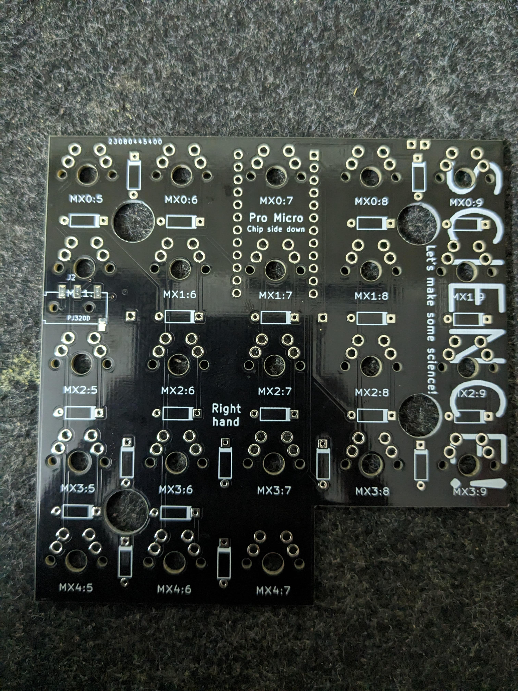
### Pro Micro:
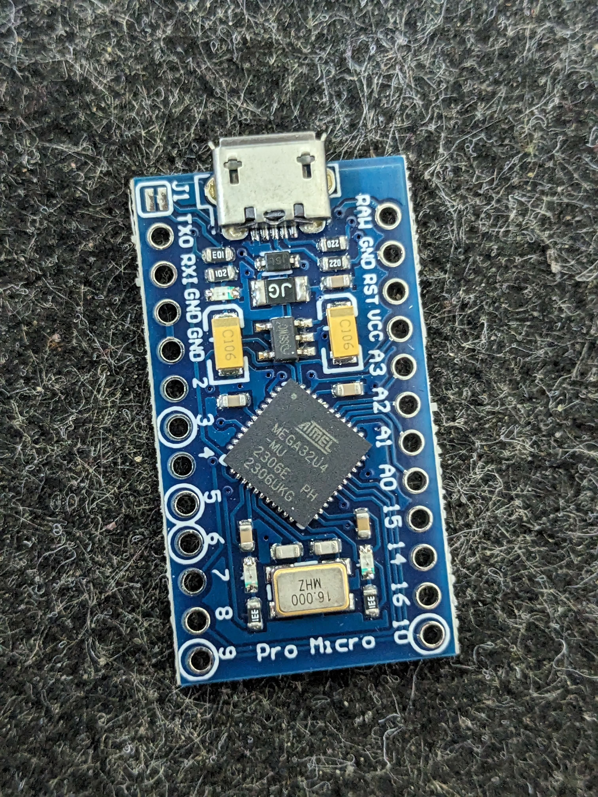
### Diodes:
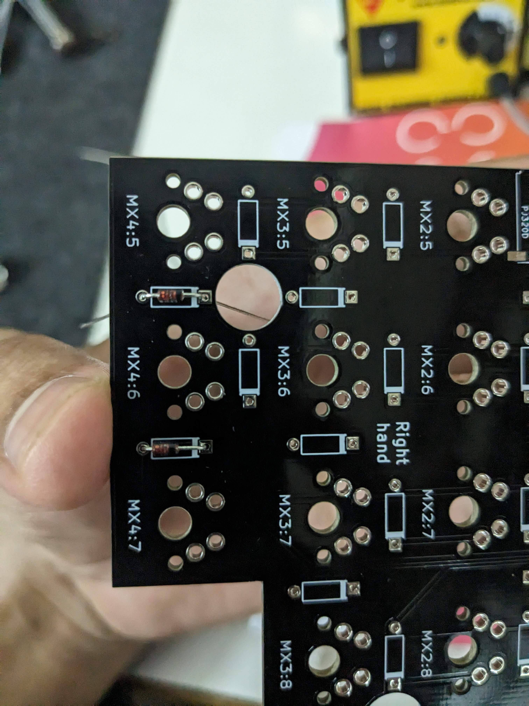
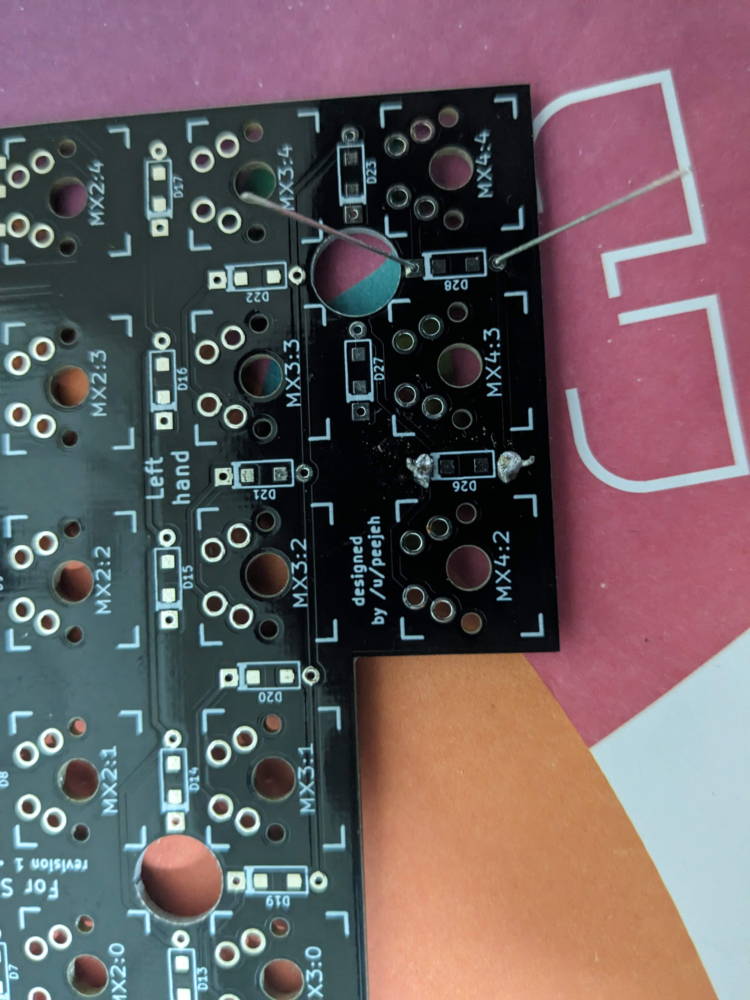
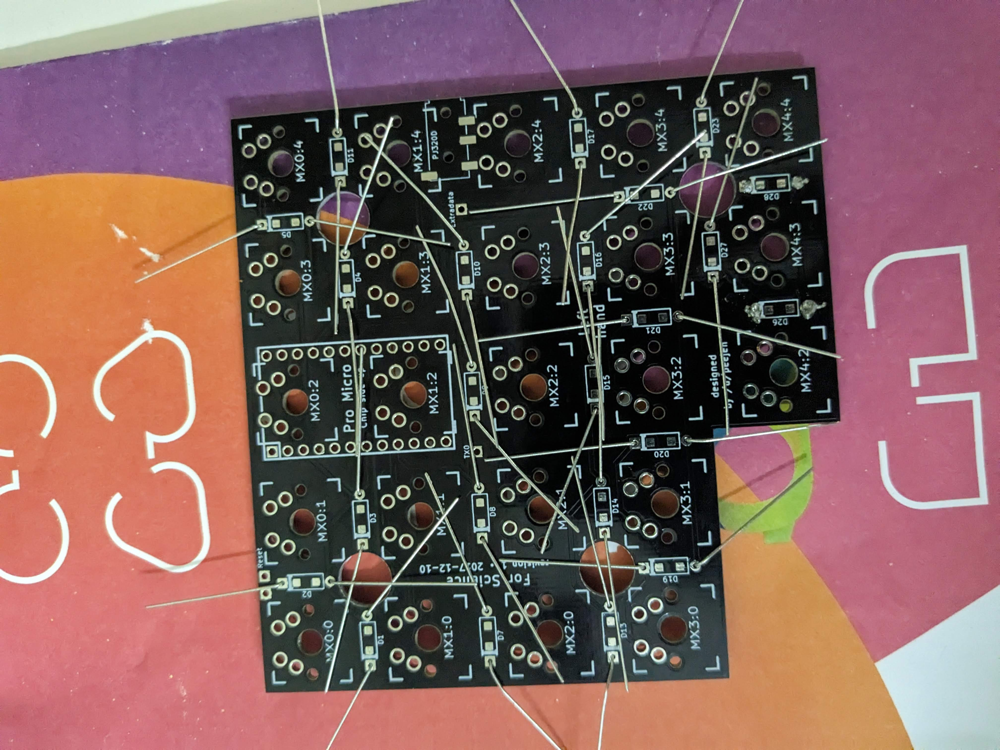
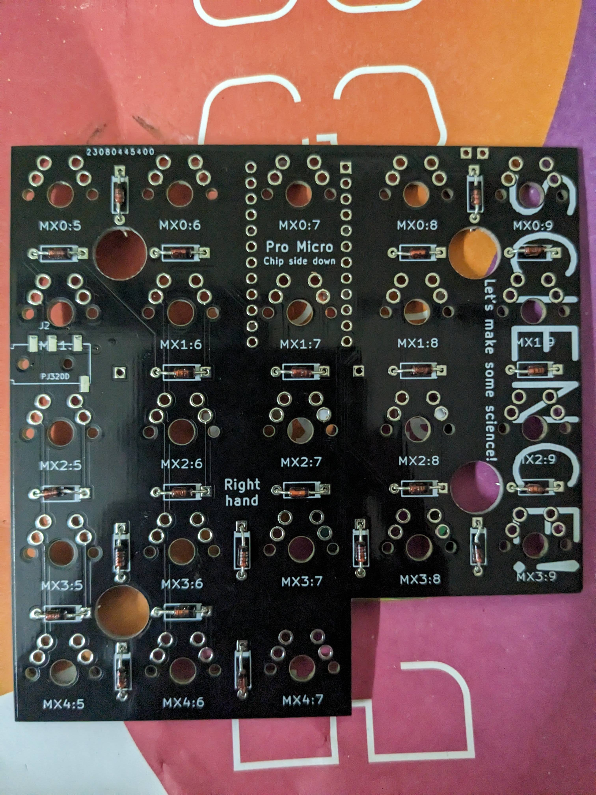
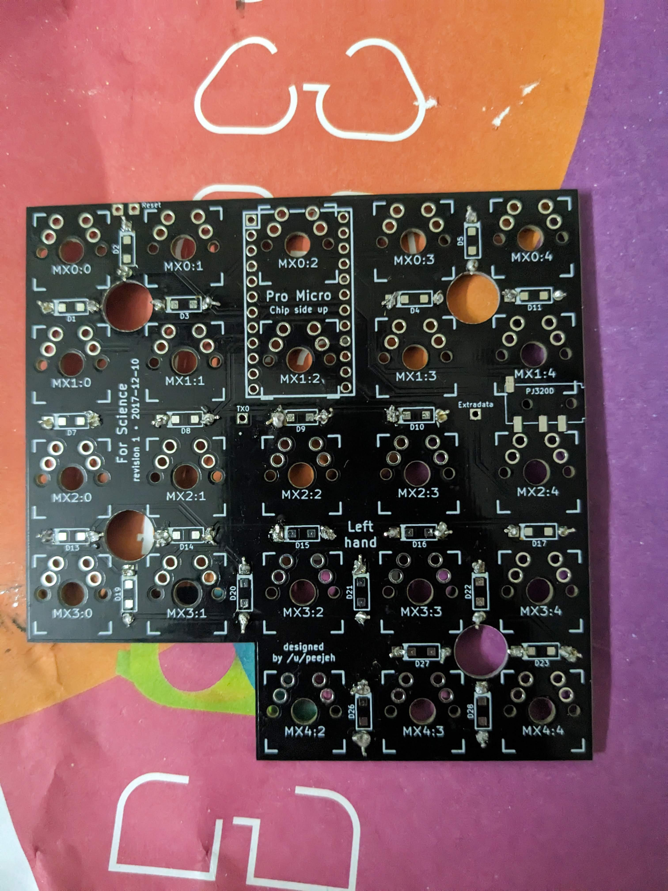
### Switches:
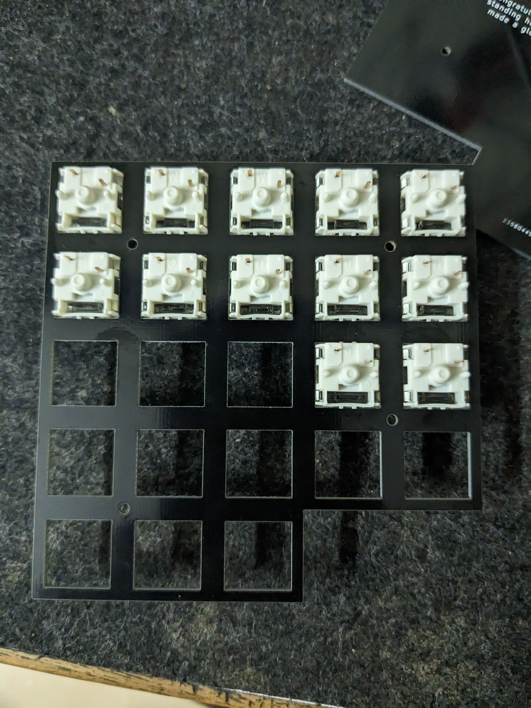
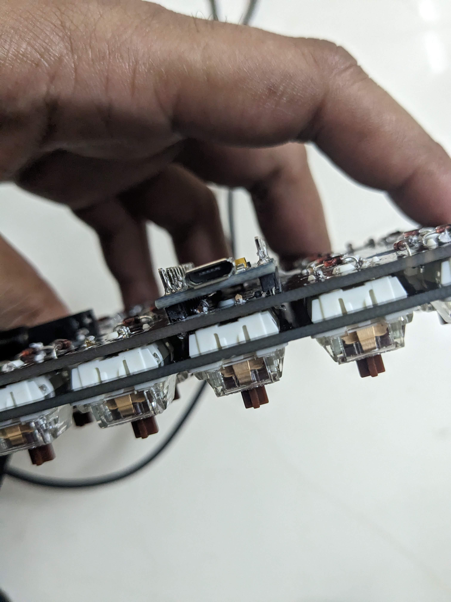
### TRRS Socket:
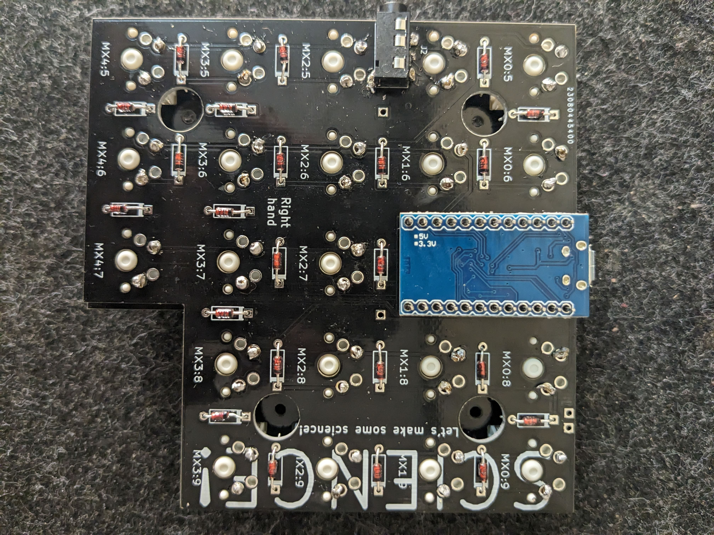
### Damaged 
Connection held through a metal pin:
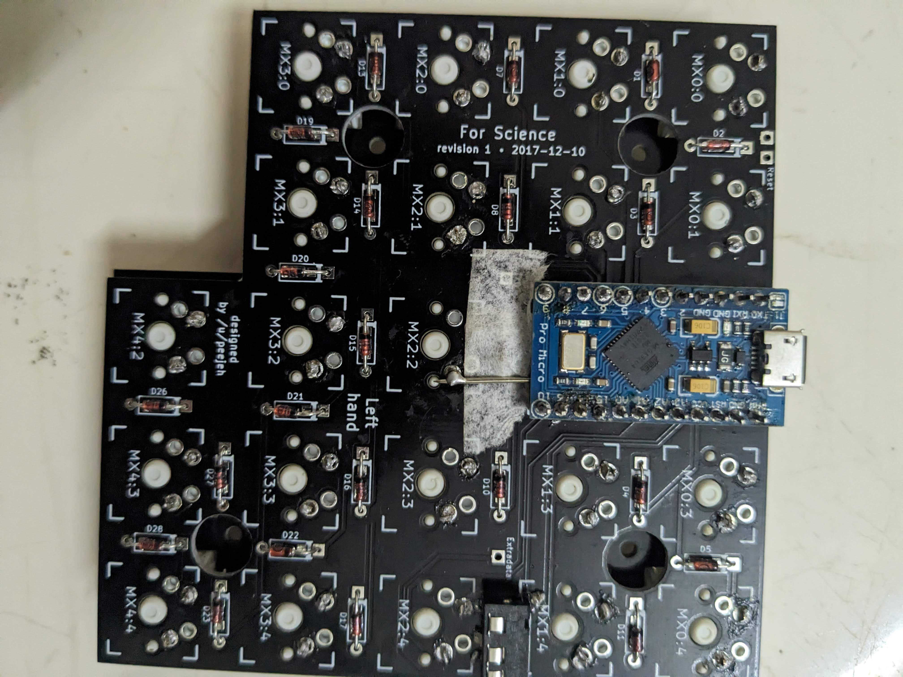
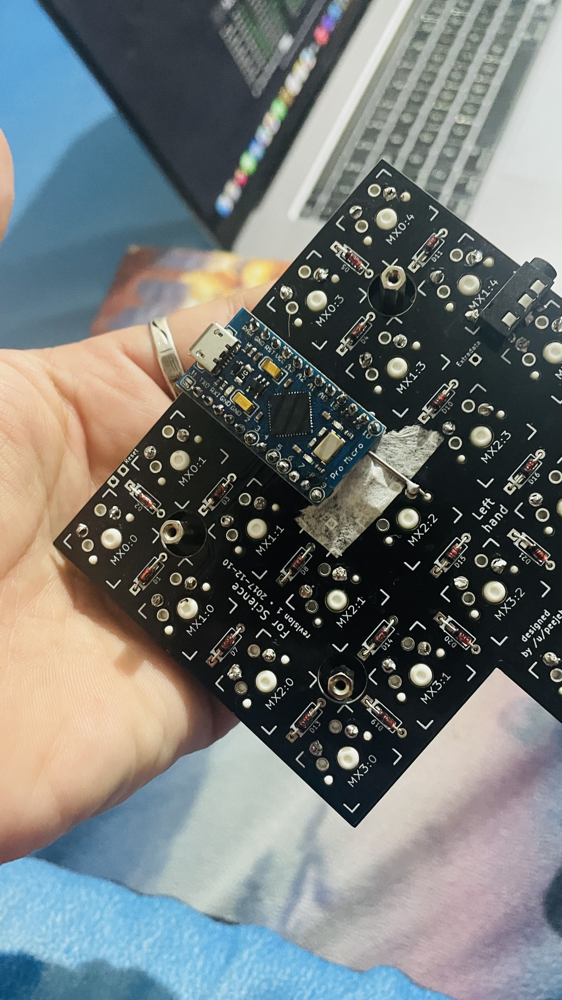
### Final Keyboard
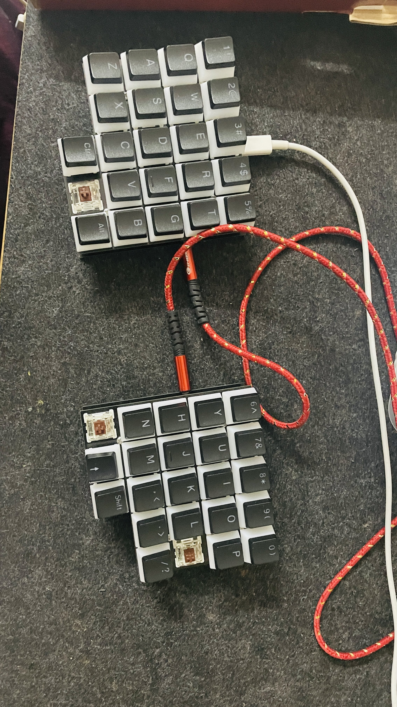
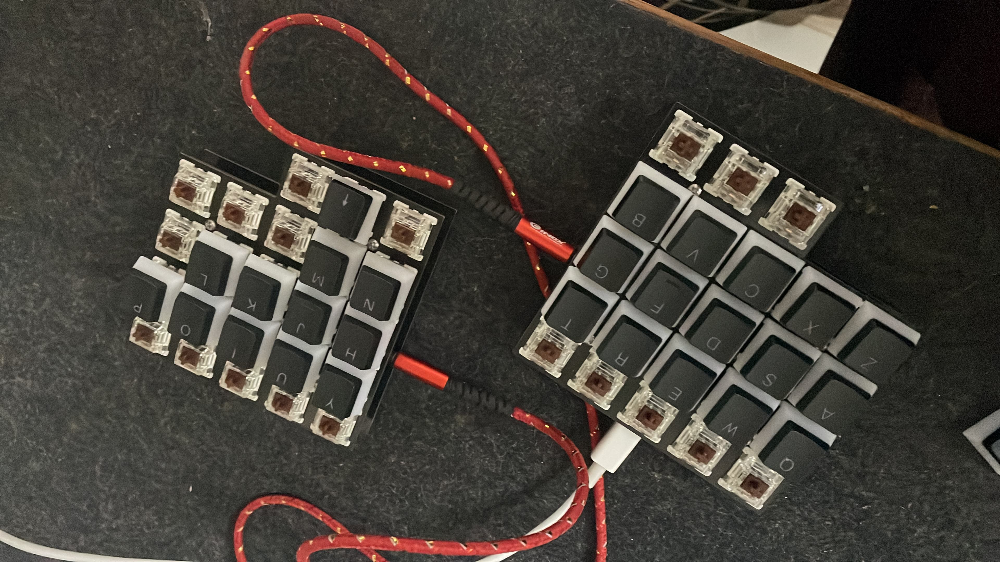
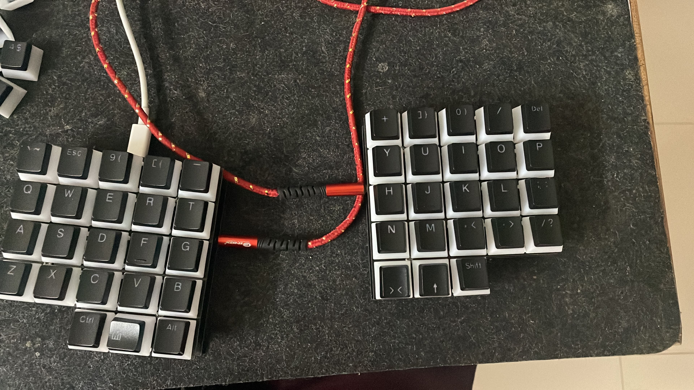

------

## HELP
Please, if you find solution for above issues, please comment or reach out to me. Thank you :)
