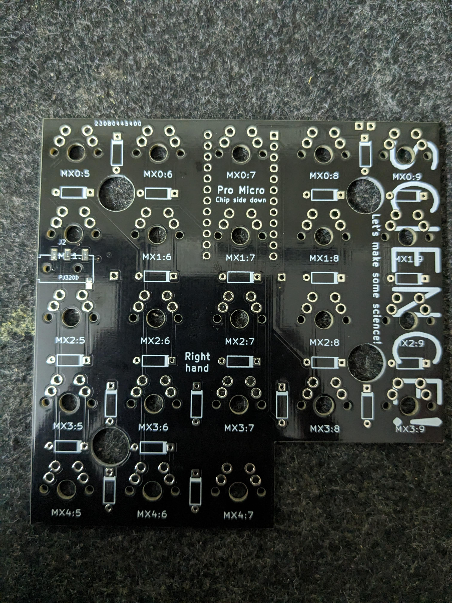

I recently built the "for-science" keyboard following this guide: [https://github.com/peej/for-science-keyboard](https://github.com/peej/for-science-keyboard).

## Bill of Materials
1. [DIY kit](https://stackskb.com/store/for-science-split-keyboard-diy-kit/): 1800 INR
2. [Arduino Pro Micro compatible x2](https://robocraze.com/products/pro-micro-5v-mini-leonardo-compatible-with-arduino): 908 INR
3. [Soldering Station](https://robocraze.com/products/soldron-variable-wattage-micro-soldering-station): 1305 INR
4. Soldering wire from Robocraze: 21 INR
5. Digital Multimeter from Robocraze: 199 INR
6. Key Switches from stackskb - Gateron G Pro 2.0 Brown KS-9 Tactile Switch - 50 pieces: 1000 INR
7. Key Caps from stackskb - Cherry Profile Pudding Keycaps - 130 caps: 1000 INR
8. TRRS cable from a local shop in Hyderabad: 200 INR
9. Desoldering Flux from a local shop in Hyderabad: 350 INR
10. Desoldering Wick from a local shop in Hyderabad: 300 INR

## Journey

During the keyboard assembly, I initially followed the aforementioned guide but found it lacking in detail. I supplemented it with another guide for the [Lily58](https://github.com/kata0510/Lily58/blob/master/Pro/Doc/buildguide_en.md).

Throughout the process, whenever I encountered doubts, I referred to the gerber file [here](https://github.com/peej/for-science-keyboard/tree/master/gerber) using [gerberlook](https://www.gerblook.org/) and utilized the TRRS jack and the Pro Micro's `D0` pin as orientation guides, as described [here](https://golem.hu/article/pro-micro-pinout/).

### Mistakes Made:
1. Poor Soldering: For novices, I recommend practicing soldering techniques, as outlined in this [blog](https://learn.adafruit.com/adafruit-guide-excellent-soldering/common-problems).
2. Soldering the Pro Micro chip before the switches caused numerous issues. Despite attempts to rectify using desoldering pumps, wicks, and flux, it resulted in damage to the switches and Pro Micro chip. Fortunately, I had spare switches and wires to salvage the situation. Lesson learned: double or triple check components before soldering to avoid the arduous and potentially damaging process of desoldering.
3. A faulty or damaged TRRS cable necessitated its replacement. Lesson: ensure circuit connectivity using the gerber files and the Multimeter's continuity mode.

### Ongoing Issues:
1. The right side operates only when connected to the left split; connecting via the right split yields no response. Attempted solutions from [this blog](https://docs.splitkb.com/hc/en-us/articles/360010588860-Only-one-half-of-my-keyboard-works-at-a-time-but-not-when-they-are-both-connected) and [this post](https://www.reddit.com/r/ErgoMechKeyboards/comments/qq1o8q/how_to_best_start_debugging_this/) were unsuccessful.
2. Periodic keyboard freezing during typing, potentially due to enabled QMK features, as detailed [here](https://github.com/qmk/qmk_firmware/compare/master...upendra1997:qmk_firmware:master).

## QMK
I guess the QMK layout [configuration](https://config.qmk.fm/#/for_science/LAYOUT_split_4x5_3) that they had was outdated and was not working properly with my keyboard, as I built the keyboard and tested them using [test-website](https://config.qmk.fm/#/test).

so I made few changes on my [fork](https://github.com/upendra1997/qmk_firmware) to make them work, and added some extra layout and features, which suited my fancy.

## Images
### PCB:

### Pro Micro:

### Diodes:

### Switches:

### TRRS Socket:

### Damaged:
Connection made via a metal pin:

### Final Keyboard:

-------

## HELP
If you have solutions to the aforementioned issues, please comment or reach out to me. Thank you :)

## Updates
Recently the right part stopped working again, and after debugging further using the mulitmeter continuity mode, found out that the issue was with the TRRS cable. This will act as note to self and any other person visiting this website that check your TRRS cable first, as it seems to be the issue most of the time.
